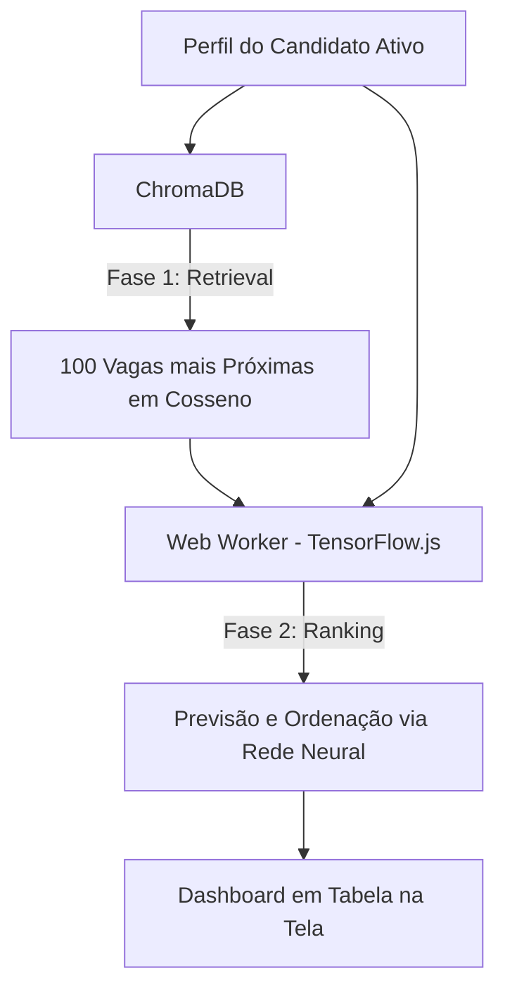

# DevMatch - Sistema Híbrido de Recomendação de Vagas

O **DevMatch** é uma aplicação didática avançada que simula um portal de empregos moderno com sistema de recomendação híbrido. O projeto combina **busca vetorial em banco de dados (ChromaDB)** para a etapa de recuperação de candidatos (*Retrieval*) e **rede neural profunda (TensorFlow.js)** rodando no navegador para a etapa de classificação personalizada (*Ranking*).

---

## 🛠️ Tecnologias Utilizadas

### Frontend (Cliente)
*   **HTML5 & CSS3:** Interface responsiva construída com estética escura de alto nível, efeitos *glassmorphism* (vidro fosco), degradês neon e luzes dinâmicas.
*   **Vanilla JavaScript (ES6+):** Arquitetura organizada sob o padrão **MVC (Model-View-Controller)** com barramento de eventos personalizado orientado a mensagens.
*   **Web Workers:** Processamento de IA isolado da thread de renderização da página, impedindo travamentos de interface.
*   **TensorFlow.js:** Criação, compilação, treino e predição do modelo de classificação de rede neural no cliente.
*   **tfjs-vis:** Visualização interativa no visor lateral contendo gráficos em tempo real da perda (*loss*) e acurácia durante o treino.

### Backend (Servidor)
*   **Node.js & Express.js:** Servidor HTTP servindo arquivos estáticos e expondo endpoints de API.
*   **ChromaDB Client (`chromadb`):** Comunicação nativa com o banco de dados vetorial.
*   **csv-parser:** Processamento stream do dataset de vagas do Kaggle.

### Infraestrutura
*   **ChromaDB (Banco Vetorial):** Instância local rodando via **Docker** na porta 8000, utilizando a métrica de **Similaridade de Cosseno** para busca vetorial rápida.

---

## 📐 Arquitetura de Recomendação Híbrida

O DevMatch replica a arquitetura moderna de recomendação de grandes empresas de tecnologia (como LinkedIn, Netflix e Spotify), dividida em duas fases:



### 1. Fase de Recuperação (Retrieval)
Quando o usuário seleciona um candidato, o backend converte seu perfil em um vetor numérico de **6 dimensões** e executa uma query no **ChromaDB**. O banco vetorial calcula instantaneamente a Similaridade de Cosseno entre o candidato e as vagas indexadas, filtrando as **100 oportunidades mais semelhantes**.
Esta etapa reduz drasticamente o espaço de busca de milhares de vagas para apenas 100 em milissegundos.

### 2. Fase de Classificação (Ranking)
As 100 vagas recuperadas são enviadas para o **Web Worker** no frontend. O worker pega o vetor do candidato atual e o concatena com os vetores de cada uma das 100 vagas (gerando um vetor de **12 dimensões**).
Esse vetor 12D é alimentado em uma **Rede Neural Treinada**, que executa a predição (`model.predict()`) para obter a afinidade exata entre o perfil e a vaga. A lista é reordenada de acordo com o score da rede e renderizada na tabela.

---

## 📊 Espaço Vetorial Unificado (Vetor 6D)

Tanto os candidatos quanto as vagas são mapeados para o mesmo espaço de 6 dimensões numéricas normalizadas:

1.  **Experiência (Anos):** Normalizado de `0.0` a `1.0` (teto de 10 anos).
2.  **Salário:** Normalizado na faixa de R$ 2.000 a R$ 20.000.
3.  **React / Frontend:** `1.0` se possuir habilidades Frontend (React, Javascript, CSS), senão `0.0`.
4.  **Node.js / Backend:** `1.0` se possuir habilidades Backend (Node.js, PostgreSQL), senão `0.0`.
5.  **Mobile / Flutter:** `1.0` se possuir habilidades Mobile (Flutter, Dart), senão `0.0`.
6.  **Modelo de Trabalho:** `1.0` para Remoto, `0.5` para Híbrido, `0.0` para Presencial.

---

## 🧠 Estrutura da Rede Neural

O modelo é um classificador binário sequencial profundo:
*   **Camada de Entrada:** 12 neurônios (Candidato 6D + Vaga 6D).
*   **Camada Oculta 1:** 128 neurônios, ativação `ReLU`.
*   **Camada Oculta 2:** 64 neurônios, ativação `ReLU`.
*   **Camada Oculta 3:** 32 neurônios, ativação `ReLU`.
*   **Camada de Saída:** 1 neurônio, ativação `Sigmoid` (retorna probabilidade de match entre `0.0` e `1.0`).

### Aprendizado Determinístico
Para que o gráfico de acurácia convirja para 100% e o erro (Loss) para zero (exibindo uma linha clássica de aprendizado sem decorebas rápidas por desbalanceamento ou ruído insolúvel), o gerador de dados simula um histórico de aplicação lógico baseado em:
*   Intersecção obrigatória de tecnologia (skills compatíveis).
*   Diferença salarial máxima de até 40%.
*   Experiência do candidato compatível com a exigida.

---

## 🚀 Como Executar o Projeto

### Pré-requisitos
*   **Node.js** instalado.
*   **Docker Desktop** instalado e rodando em background.

### 1. Iniciar o ChromaDB
Inicie o container do banco vetorial no Docker:
```bash
docker run -d -p 8000:8000 --name chromadb-local chromadb/chroma
```
*(Se já criou anteriormente, use `docker start chromadb-local`)*.

### 2. Instalar as Dependências
Navegue até a pasta do projeto e instale as dependências:
```bash
npm install
```

### 3. Importar dados do Kaggle
Para popular a base com dados de vagas reais, coloque o arquivo `fake_job_postings.csv` do Kaggle na pasta `/data` e processe o script:
```bash
node src/backend/preprocess.js
```
Isso gerará as primeiras 100 vagas de tecnologia estruturadas no arquivo `data/jobs.json`.

### 4. Iniciar o Servidor
Execute o script de inicialização do Express:
```bash
npm start
```
O console deverá registrar a reinicialização e alimentação do banco vetorial no ChromaDB.

### 5. Acessar a Interface
Abra no navegador a URL:
```text
http://localhost:3000
```
O visor com os gráficos do TensorFlow se abrirá na lateral direita automaticamente e iniciará o treinamento. Uma vez concluído, o visor fechará e você poderá testar a busca de vagas selecionando qualquer candidato no menu lateral.
